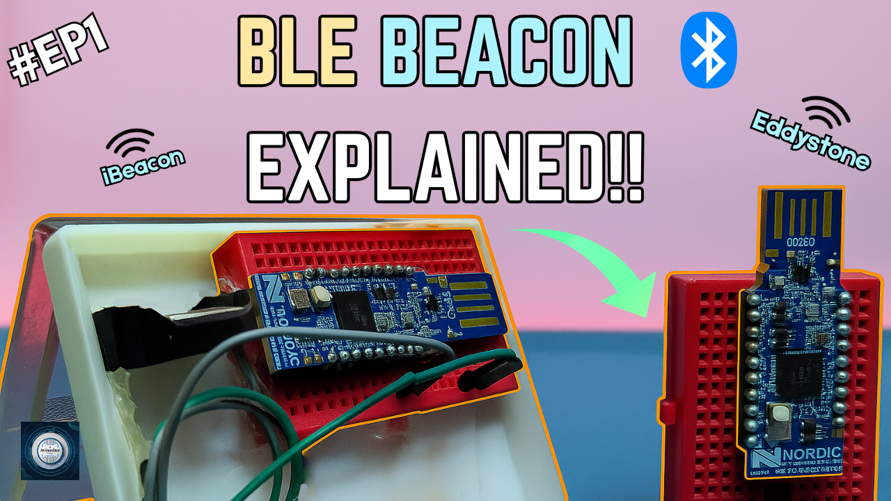
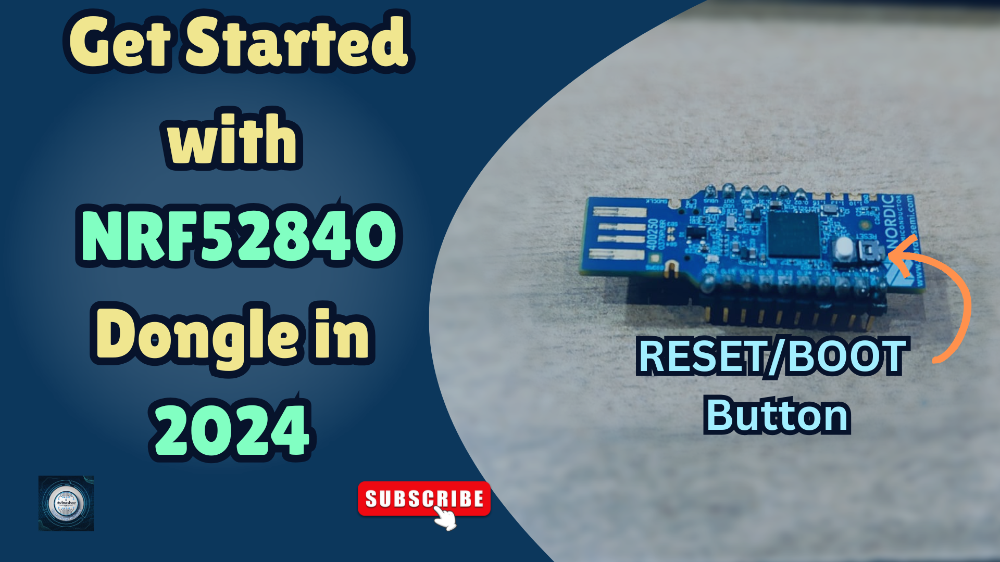

<h1 align="center">
  <a href="https://www.youtube.com/@eccentric_engineer">
	
  </a>  
</h1>

<h3 align="center">
	nRF52 BLE Beacon Formats — iBeacon, Eddystone & Custom UUID
</h3>


  
## 📝 Overview

This repository demonstrates how to configure an nRF52 USB dongle (nRF52840) to act as a BLE beacon using three popular formats:
iBeacon.
Eddystone.
Custom UUID.
All implementations use non-connectable advertising (beacon/broadcaster mode) with a focus on low power, one-way communication.

Platform used for firmware development is nRF Connect SDK on VSCode.  
Learn more 👇👇  
  
[](https://youtu.be/9BfXs-nhFsU)

## ✔️ Requirements

### 📦 Hardware
- nRF52840 Dongle (main controller  board)
- USB Female to Male Cable (optional, but recommended) 

### 📂 Software
- VSCode (https://code.visualstudio.com/)  
- nRF Connect SDK (https://www.nordicsemi.com/Products/Development-software/nRF-Connect-SDK)
- nRF Connect for Desktop (https://www.nordicsemi.com/Products/Development-tools/nRF-Connect-for-Desktop)

## 🛠️ Installation and usage

```sh
git clone https://github.com/AvinasheeTech/nrf52-ble-beacon.git
Open project in VSCode
Add Build Configuration -> Select nrf52840dongle_nrf52840 as board target -> Generate and Build
Open nRF Connect For Desktop App
Next Select Programmer -> Put Board in Bootloader mode -> Select Device -> Upload zephyr.hex output file from Build Directory of Project
Turn on Bluetooth and Location on Mobile Device -> Open NRF Connect App -> Check Beacon Advertisement data 
Enjoy...🍹
```
To learn more about how to upload code to nRF52840 Dongle using VSCode and nRF Connect SDK, click link below 👇👇  

[](https://youtu.be/TeBvb645NZA?si=z5goAc1ic0ipf2cX)


## ⭐️ Show Your Support

If you find this helpful or interesting, please consider giving us a star on GitHub. Your support helps promote the project and lets others know that it's worth checking out. 

Thank you for your support! 🌟

[](https://github.com/AvinasheeTech/nrf52-ble-beacon/stargazers)
